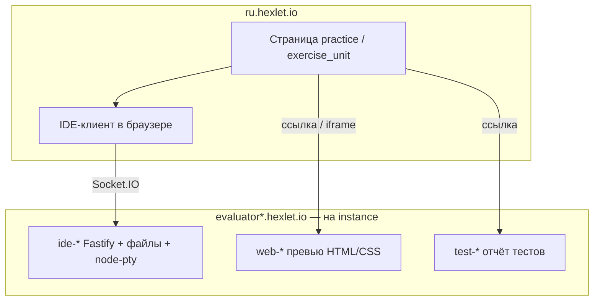

# Отчёт: как устроена платформа Hexlet (редактор и упражнения)

**Дата исследования:** 2026-06-10  
**Метод:** авторизованный доступ к `ru.hexlet.io`, разбор Inertia JSON на страницах практики, анализ фронтенд-бандла `exercise-59NoZEz_.js`, сравнение типов упражнений (JS / вёрстка / React / TypeScript / испытания).

> Цель документа — зафиксировать архитектуру Hexlet как референс для IT Птица Mentor (`education-platform`), без копирования контента и без зависимости от их куки/инфраструктуры в проде.

---

## 1. Общая картина

Hexlet — это **двухслойная система**:

| Слой | Где живёт | Задача |
|------|-----------|--------|
| **Оболочка курса** | `ru.hexlet.io` (Rails + Inertia.js + React/Mantine) | Навигация, теория, прогресс, readme, кнопки WebUI/TestUI, запуск сессии |
| **Workspace (IDE)** | Поддомены `*.evaluator{N}-{M}.hexlet.io` | Редактор, файлы, терминал, REPL, прогон тестов |

Студент на странице практики видит **встроенный IDE-клиент** (не iframe на `vscode.dev`). Клиент по **Socket.IO** подключается к серверу на `ide_url`. Отдельно есть ссылки на `web_url` (превью) и `test_url` (отчёт тестов).



---

## 2. Модель данных на странице практики

Компонент Inertia: `web/courses/lessons/exercise_unit`.

Сервер отдаёт в props (упрощённо):

```json
{
  "exercise": {
    "slug": "js_basics_variables_exercise",
    "kind": "exercise",
    "language": "javascript",
    "has_web_view": false,
    "has_test_view": false,
    "reviewable": true,
    "readme": "…markdown…"
  },
  "instance": {
    "id": 10372472,
    "files_to_open": ["solution.js"],
    "prepared_readme": "…",
    "has_new_exercise_build": false,
    "waiting_time_limit": 1200
  },
  "run": {
    "id": 19266747,
    "state": "not_pulled",
    "server_status": "alive",
    "ide_url": "https://ide-js-basics-variables-10372472.evaluator3-3.hexlet.io:443",
    "web_url": "https://web-js-basics-variables-10372472.evaluator3-3.hexlet.io:443",
    "test_url": "https://test-js-basics-variables-10372472.evaluator3-3.hexlet.io:443",
    "exercise_finished": false
  }
}
```

### Ключевые поля

| Поле | Смысл |
|------|--------|
| `instance.id` | Ключ сессии workspace (`sessionKey` на клиенте) |
| `files_to_open` | Какие вкладки открыть в Monaco |
| `run.state` | `not_pulled` → контейнер/воркспейс ещё не поднят; после старта — активная сессия |
| `ide_url` / `web_url` / `test_url` | Три сервиса на **один instance**, разные роли |
| `has_web_view` | Показывать ли кнопку **WebUI** (визуальный превью) |
| `has_test_view` | Показывать ли **TestUI** (задания «напиши тесты») |

Именование поддоменов:  
`{ide|web|test}-{exercise-slug}-{instanceId}.evaluator{pool}-{shard}.hexlet.io`

Пулы evaluator различаются по типу нагрузки (наблюдались `evaluator2-3`, `evaluator3-3`, `evaluator5-3`).

---

## 3. IDE-клиент (фронтенд)

Источник: бандл `exercise-59NoZEz_.js` + встроенная справка «Как устроен редактор» (ru/en/es).

### Стек

| Технология | Роль |
|------------|------|
| **TypeScript, React, Mantine, Zustand** | UI, состояние вкладок/панелей/подключения |
| **Monaco Editor** | Редактирование кода |
| **xterm.js** | Терминал(ы) |
| **REPL** | Отдельная вкладка для экспериментов |
| **Vite** | Сборка клиента |
| **Socket.IO** | Синхронизация файлов, терминалы, запуск проверки |

Хук `vb({ url: run.ide_url, sessionKey: instance.id, filesToOpen, readme, … })` поднимает workspace и отдаёт API редактору: `runTests`, `saveFile`, `openFile`, состояние тестов (`testsRunningState`, `testOutput`, `testExitStatus`).

### Компоновка UI

Из официальной справки Hexlet:

- **Слева** — дерево файлов проекта  
- **По центру** — Monaco, вкладки файлов  
- **Снизу** — терминалы + REPL  
- **Справа** — панель: «Проверить», скрыть/показать дерево и нижнюю панель, индикатор подключения  
- **Вкладка «Вывод»** — результат проверки (`npm test` / аналог)

Перед проверкой клиент **автоматически отправляет изменённые файлы** на сервер.

Дополнительно на уровне урока (не внутри Monaco):

- **WebUI** — iframe на `web_url` для HTML/CSS-заданий  
- **TestUI** — отчёт на `test_url` для заданий на написание тестов  

### Что это **не** является

- Не полноценный **VS Code в браузере** (`vscode.dev` / code-server) как основной UI  
- Не **Sandpack** / **WebContainers** в публичном бандле практики  
- Собственный thin IDE + удалённый workspace-сервер

---

## 4. Workspace-сервер (бэкенд evaluator)

Из той же встроенной документации в бандле:

| Технология | Роль |
|------------|------|
| **TypeScript, Fastify** | HTTP + WebSocket/Socket.IO API |
| **Файловая система** | Чтение/запись файлов упражнения, дерево проекта |
| **node-pty** | Псевдо-терминалы в браузере |

Сервер поднимается **per exercise instance** (отдельный поддомен на каждую сессию/инстанс), а не один общий runner на всех студентов.

---

## 5. Типы упражнений (что меняется между курсами)

Один и тот же IDE-шелл; меняются **шаблон репозитория**, **флаги** и **Docker-образ** на evaluator.

### Наблюдавшиеся примеры (аккаунт frontend-программы)

| Тип | Пример URL | `language` | Файлы | `has_web_view` | Особенности |
|-----|------------|------------|-------|----------------|-------------|
| **JS** | `js-basics/lessons/variables/exercise_unit` | `javascript` | `solution.js` | `false` | Проверка через тесты, без превью |
| **React (JSX)** | `js-react/lessons/jsx/exercise_unit` | `javascript` | `src/Card.jsx` | `false` | В readme: «без визуальной составляющей», тесты на JSX |
| **TypeScript** | `typescript-advanced/lessons/class-fields/exercise_unit` | `javascript`* | `solution.ts` | `false` | Метаданные `language` часто `javascript`, расширение задаёт TS |
| **Вёрстка / CSS** | `css-flex/lessons/flex-grow/exercise_unit` | `html` | `index.html`, `styles/app.css` | **`true`** | Кнопка WebUI → `web_url` |
| **Испытания (challenges)** | `challenges/http_blog_exercise` | `shell` | `solution` | `false` | `kind: challenge`, telnet/HTTP в терминале |

\* Поле `language` в JSON не всегда совпадает с реальным стеком файлов.

### Флаги превью и тестового UI

- **`has_web_view: true`** — ожидается визуальный результат (вёрстка).  
- **`has_test_view: true`** — задания, где студент пишет тесты; открывается TestUI (в доступных курсах аккаунта таких не встретилось, но описано в справке).

### Readme как контракт

Условие задачи хранится в **markdown** (`readme` / `prepared_readme`): список файлов, что менять, примеры ввода-вывода. Это SSOT текста задания на стороне Hexlet.

---

## 6. Жизненный цикл проверки

1. Студент открывает `…/exercise_unit`.  
2. Бэкенд создаёт/возвращает `instance` + `run` с URL evaluator.  
3. IDE-клиент коннектится к `ide_url` (`state` может быть `not_pulled` до первого pull).  
4. Студент правит файлы в Monaco; изменения синхронизируются по Socket.IO.  
5. «Проверить» → сервер гоняет тесты → вывод во вкладке «Вывод».  
6. «Сохранить решение» → снимок на стороне Hexlet, ссылка для просмотра/сравнения с эталоном (если упражнение решено).

Таймаут ожидания между попытками: `waiting_time_limit` (наблюдалось 1200 с).

---

## 7. Курсовая оболочка (вне редактора)

- **Rails + Inertia.js** — SSR/гидратация страниц (`data-page="app"`).  
- **Mantine** — UI курса, навигация, прогресс.  
- Юниты урока: `theory_unit`, `exercise_unit`, `quiz_unit`.  
- Отдельно: **code review**, обсуждения, AI-чат на странице урока.  
- Программы/курсы: `/my/courses`, профессии `frontend`, `js-react-developer` и т.д.

Редактор — **модуль внутри урока**, а не отдельное SPA всей платформы.

---

## 8. Сравнение с нашим `education-platform` (вариант 2)

| Аспект | Hexlet | IT Птица Mentor (MVP) |
|--------|--------|------------------------|
| Редактор | Monaco + терминал + REPL | Monaco only (пока) |
| Связь с раннером | Socket.IO, постоянная сессия | HTTP POST `/check` |
| Инфраструктура | Кластер evaluator, pod на instance | Один shared runner, temp dir + Vitest |
| Контент | Внутренние шаблоны + Docker-образы | `exercises/{slug}/` + `exercise.json` (SSOT) |
| Превью вёрстки | Отдельный `web_url` | Не реализовано (этап 2) |
| Auth | Аккаунт Hexlet | Планируется Telegram |

Наш осознанный упрощённый путь: **тот же UX-скелет** (readme + редактор + проверить + вывод), без orchestration evaluator на старте.

---

## 9. Выводы для дорожной карты

### Что стоит перенять по идее

1. **Единый IDE-шелл** для разных типов задач; различие — в manifest упражнения и шаблоне файлов.  
2. **`files_to_open` + readme markdown** — понятный контракт для авторов заданий.  
3. **Разделение ролей**: редактор / web preview / test report (даже если сначала только editor + test output).  
4. **Автосохранение перед проверкой** — меньше «забыл отправить файл».

### Что не обязательно копировать на MVP

1. **Per-user evaluator subdomains** — дорого в DevOps; достаточно shared runner + позже Docker.  
2. **Socket.IO + node-pty** — нужны только когда появятся терминал, REPL, multi-file dev server.  
3. **Полный клон UI** — достаточно своего визуального языка (у нас: `@ptitsa/web`).

### Рекомендуемый порядок развития нашей платформы

1. ✅ JS single-file + Vitest (`js-variables`)  
2. Ещё 2–3 JS-тренажёра (функции, массивы)  
3. React multi-file (как `React-Counter` в GitHub Classroom)  
4. Static web preview (аналог `web_url`)  
5. Терминал / REPL (Socket.IO + pty) — если нужен parity с Hexlet для CLI/испытаний  
6. Auth, деплой на `education.*`, привязка к roadmap

---

## 10. Ограничения и этика исследования

- Отчёт основан на **внешнем наблюдении** публичного/авторизованного UI и JS-бандлов, не на исходниках Hexlet.  
- Детали orchestration (Kubernetes, образы, внутренние API pull) **не подтверждены** — только косвенные признаки (`not_pulled`, `server_status: alive`).  
- **Куки сессии** использовать только для локального reverse-engineering; не коммитить, ротировать после исследования.  
- Контент упражнений Hexlet **не копировать** — только формат и архитектура.

---

## Приложение A. Полезные URL-паттерны

```
/courses/{course}/lessons/{lesson}/exercise_unit
/courses/{course}/lessons/{lesson}/theory_unit
/courses/{course}/lessons/{lesson}/quiz_unit
/challenges/{challenge_slug}
/my/courses
```

## Приложение B. Файлы нашего проекта по теме

| Документ / код | Путь |
|----------------|------|
| Дизайн MVP JS-тренажёра | `docs/superpowers/specs/2026-06-10-js-trainer-design.md` |
| Репозиторий платформы | `it-ptitsa-mentor/education-platform` |
| Shared Vitest config для runner | `packages/runner/vitest.exercise.config.ts` |
| Пример упражнения | `exercises/js-variables/` |
